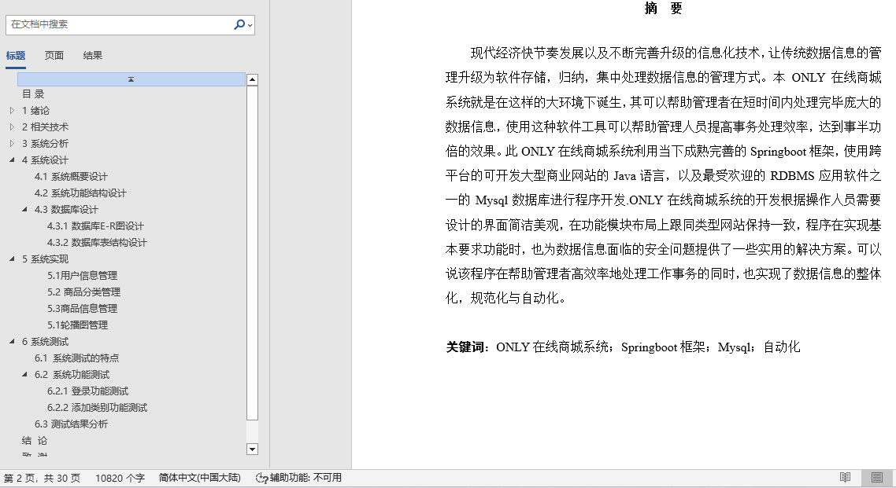
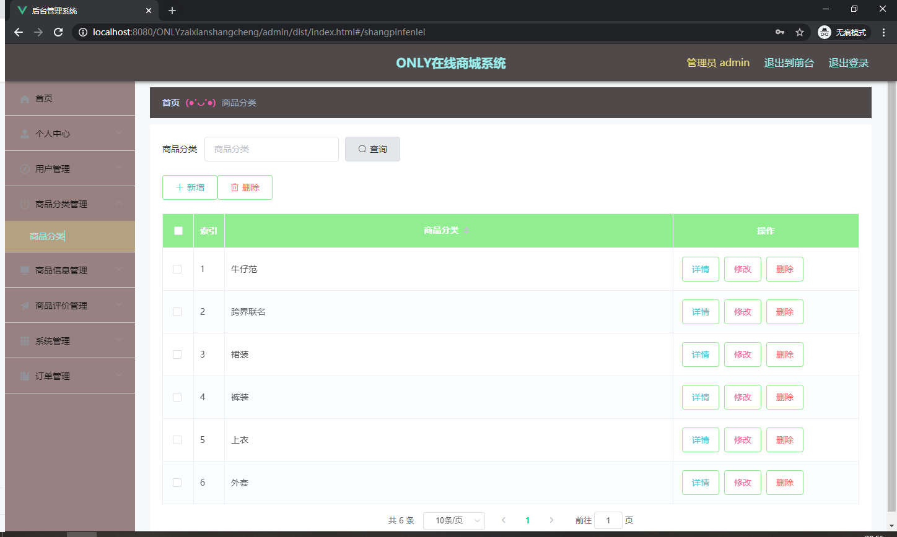
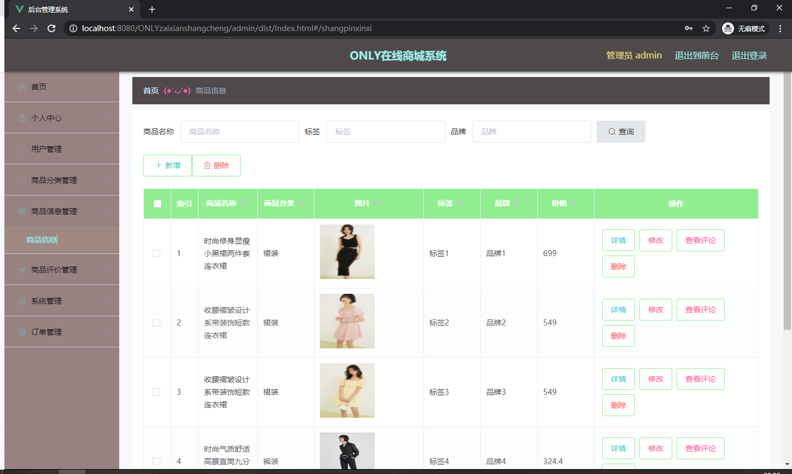
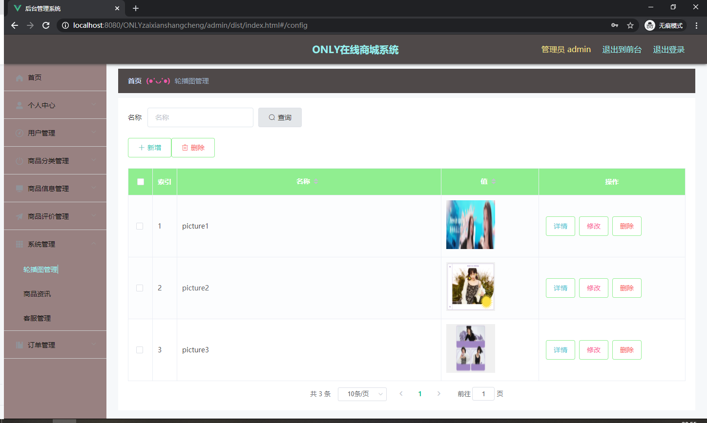
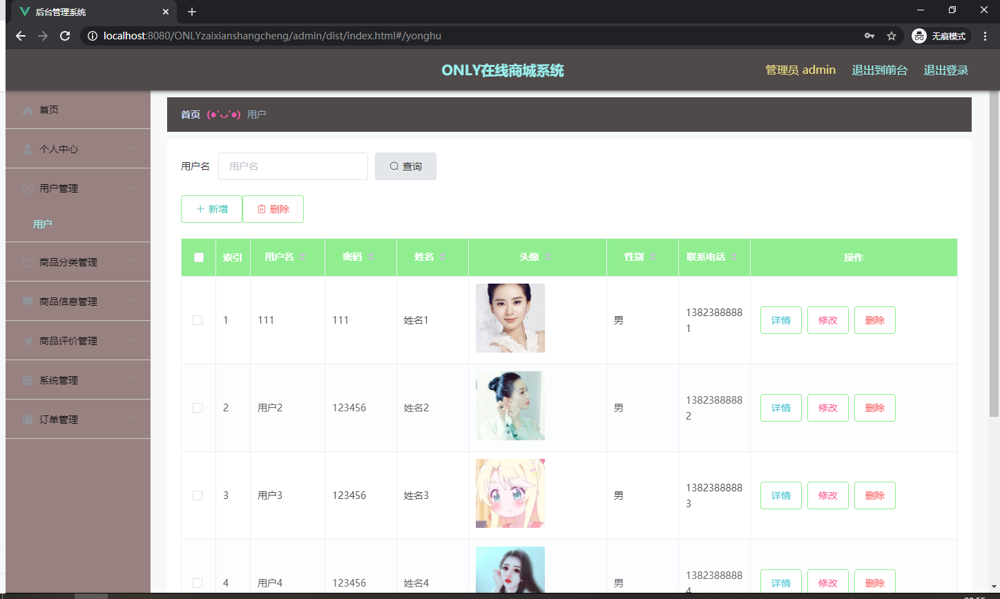

## 在线商城系统(程序+报告)

- <b>完整代码获取地址：从戎源码网 ([https://armycodes.com/](https://armycodes.com/))</b>
- <b>技术探讨、资料分享，请加QQ群：692619798</b> 
- <b>作者微信：19941326836  QQ：952045282</b> 
- <b>承接计算机毕业设计、Java毕业设计、Python毕业设计、深度学习、机器学习</b>
- <b>选题+开题报告+任务书+程序定制+安装调试+论文+答辩ppt 一条龙服务</b>
- <b>所有选题地址 ([https://github.com/YuLin-Coder/AllProjectCatalog](https://github.com/YuLin-Coder/AllProjectCatalog)) </b>

## 项目介绍
在线商城系统，系统包含两种角色：用户、管理员，系统分为前台和后台两大模块，主要功能如下：

管理员登录  
管理员通过填写用户名、密码和角色等信息进行登录，登录成功后进入小徐影城管理系统。

1管理员功能实现

- 管理员功能界面  
  管理员登录后可以访问首页、个人中心、用户管理、电影类型管理、放映厅管理、电影信息管理、购票统计管理、系统管理、订单管理等功能模块。

- 用户管理  
  在用户管理页面，管理员可以查看用户的用户名、姓名、头像、性别、联系电话等信息，并进行详情查看、删除或修改操作。

- 电影类型管理  
  管理员可以在电影类型管理页面查看电影类型信息，并进行详情查看、删除或修改操作。

- 放映厅管理  
  在放映厅管理页面，管理员可以查看放映厅信息，并进行详情查看、删除或修改操作.

- 电影信息管理  
  管理员可以在电影信息管理页面查看电影名称、类型、海报、导演、主演、上映日期、片长、电影预告、放映厅、场次、价格、座位总数、已选座位等信息，并进行详情查看、统计、查看评论、删除或修改操作。

- 购票统计管理  
  在购票统计管理页面，管理员可以查看电影名称、类型、海报、导演、用户名、联系电话、购票数量、购票金额、购票日期、备注等信息，并进行详情查看、删除或修改操作。

- 电影资讯  
  管理员可以在电影资讯页面查看标题、简介、图片等信息，并进行详情查看、删除或修改操作。

- 轮播图管理  
  管理员可以在轮播图管理页面进行首页轮播图的管理，包括新增、修改或删除图片。

- 订单管理  
  在订单管理页面，管理员可以查看订单编号、商品名称、商品图片、购买数量、价格/积分、折扣价格、总价格/总积分、折扣总价格、支付类型、状态、地址等信息，并进行详情查看、发货或删除操作。

2用户前台功能实现

- 前台功能界面  
  在前台首页，用户可以查看首页、电影信息、电影资讯、个人中心、后台管理、在线客服等内容。

- 用户注册  
  用户在注册页面填写用户名、密码、姓名、联系电话等信息进行注册。

- 用户登录  
  用户在登录页面填写账号、密码等信息进行登录。

- 个人中心  
  在个人中心页面，用户可以更新用户名、密码、姓名、头像、性别、联系电话、余额等信息，并进行充值、更新信息或退出登录操作。

- 电影信息  
  用户在电影信息页面可以查看电影名称、类型、海报、导演、主演、上映日期、片长、电影预告、放映厅、场次、价格、座位总数、点击次数、已选座位等详细信息，并进行收藏或预定操作。

- 我的订单  
  在我的订单页面，用户可以查看订单编号、商品、价格、数量、总价、地址等详细信息，并进行确认收货等操作。

## 项目技术
- 编程语言：Java
- 数据库：MySQL
- 项目管理工具：Maven
- 前端技术：HTML、CSS、JavaScript、Vue
- 后端技术：Spring、SpringMVC、MyBatis

## 运行环境
- JDK版本：JDK1.8及以上
- 开发工具：IDEA、Ecplise、Myecplise都可以
- 数据库: MySQL5.7及以上
- Maven：maven3.0及以上
- Node：14.14.0及以上

## 运行截图

